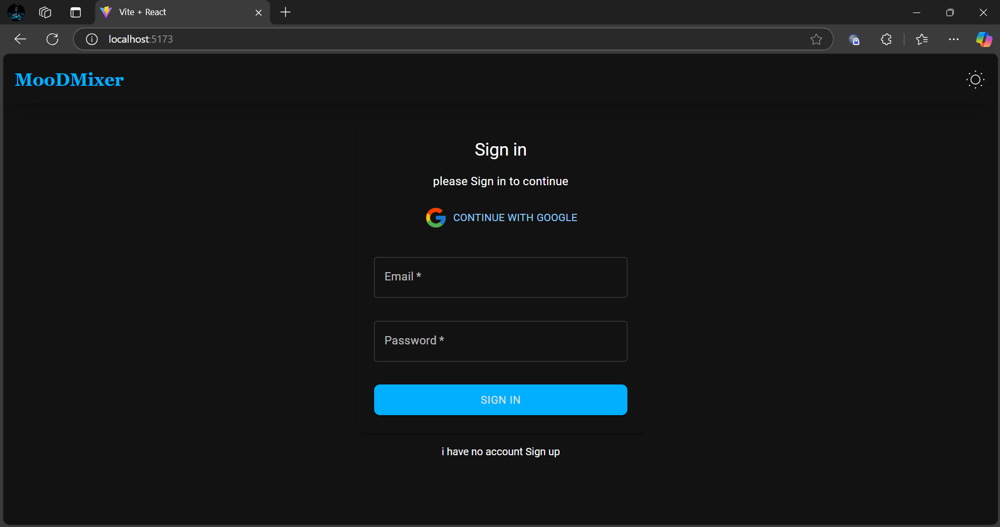
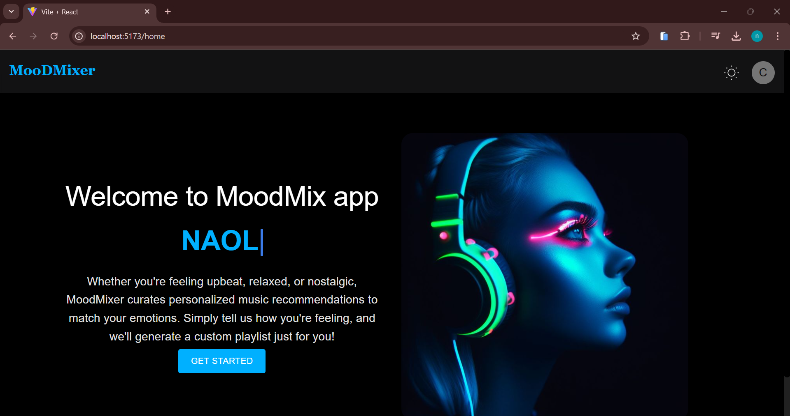
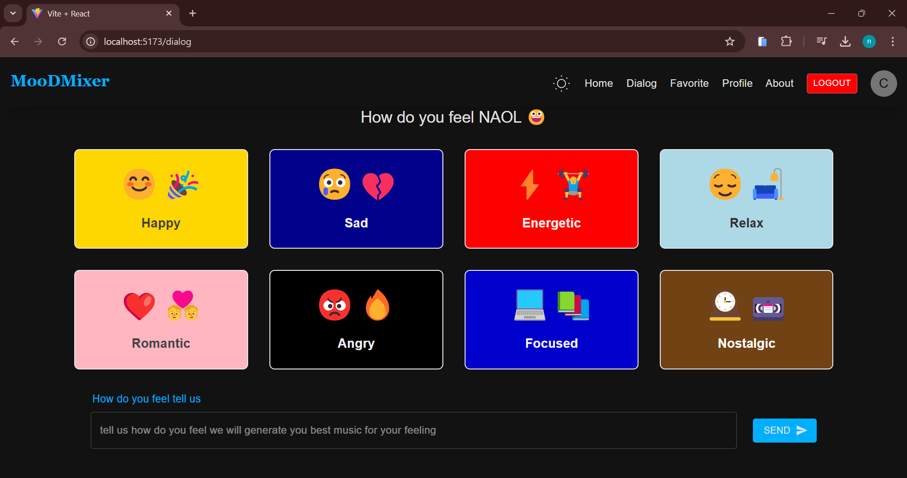
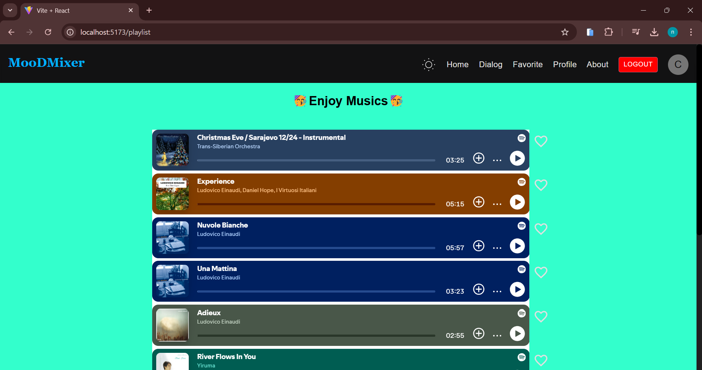
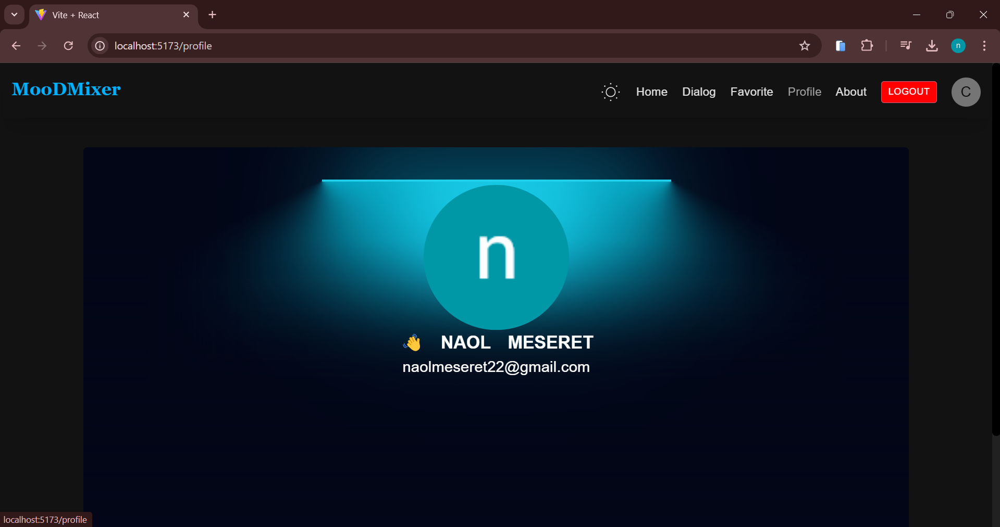
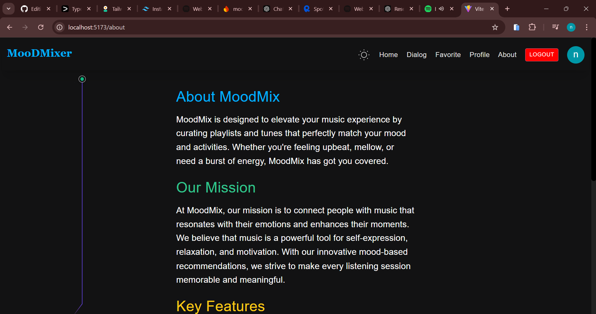

# MoodMix 🎵

**MoodMix** is an innovative music recommendation app that curates playlists based on your mood. Powered by AI and real-time analytics, MoodMix helps you discover the perfect soundtrack for any moment.

## 🚀 Features
---
- **Mood Detection**: Analyze your input to recommend mood-based playlists.
- **Personalized Playlists**: Tailored song recommendations based on user preferences.
- **Real-time Updates**: Dynamic music suggestions based on changing moods.
- **User Authentication**: Secure sign-up/login using Firebase Authentication.
- **Cross-Platform**: Accessible on desktop and mobile.
---
## 🖥️ Technologies Used

- **Frontend**: React
- **Backend**: spotify api and copilot api
- **Authentication**: Firebase Authentication
- **Real-time Updates**: Firebase Realtime Database
- **Deployment**: Vercel

---
## 📸 Screenshots
### 1,Login page

### 2. Home Page

### 3. Dialog Page

### 4. Generated Page

### 5. Profile Page

### 6. About Page



## ⚙️ Installation

1. **Clone the Repository**:
   ```bash
   git clone https://github.com/your-username/moodmix.git
   cd moodmix
   npm install
2 REACT_APP_FIREBASE_API_KEY=your-firebase-api-key
 REACT_APP_FIREBASE_AUTH_DOMAIN=your-firebase-auth-domain
 REACT_APP_FIREBASE_PROJECT_ID=your-firebase-project-id
 REACT_APP_FIREBASE_STORAGE_BUCKET=your-firebase-storage-bucket
 REACT_APP_FIREBASE_MESSAGING_SENDER_ID=your-firebase-messaging-sender-id
 REACT_APP_FIREBASE_APP_ID=your-firebase-app-id
3 start at localhost
```bash
npm start

